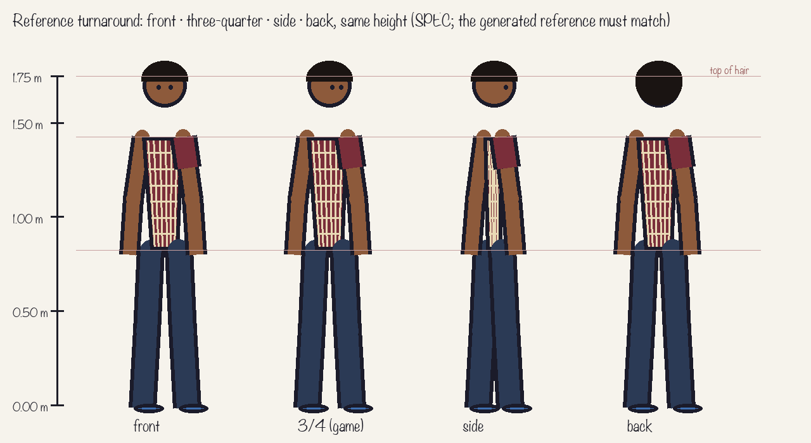
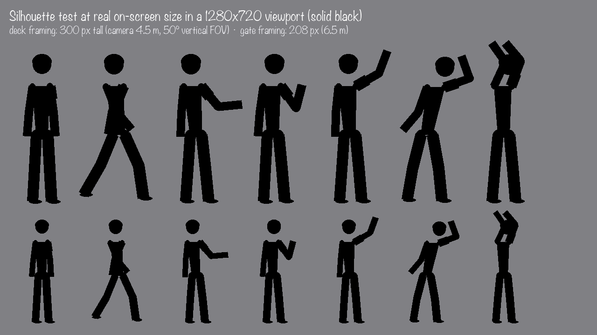
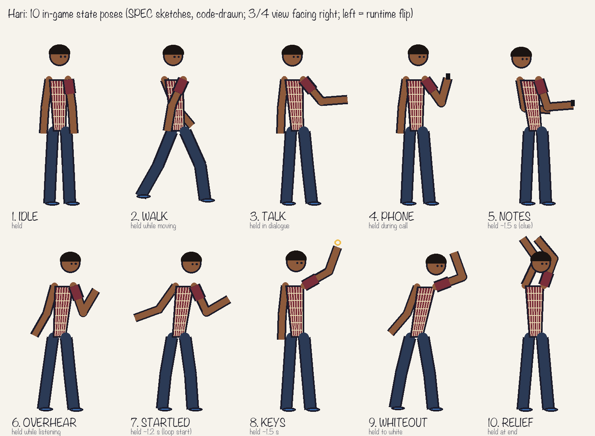
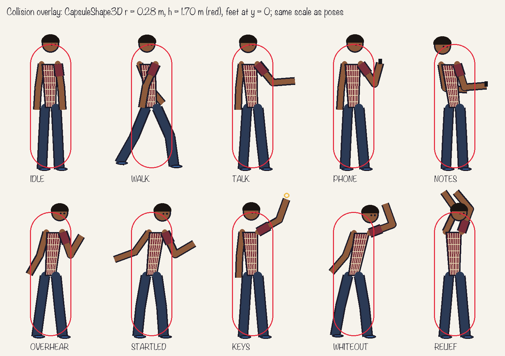
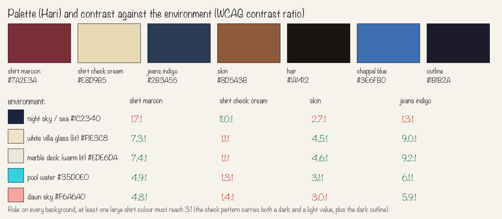
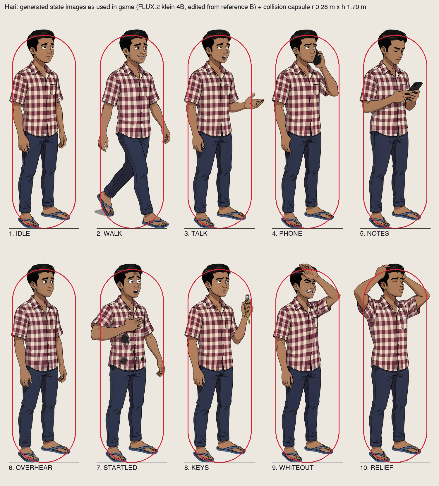

# Character sheet: Hari

*Revision 1, 2026-10-06: the SPECIFICATION, committed before any generation.*
*The character is Shriram's (STORY-BIBLE-v1, section 6). Pose list, proportions, palette and collision: Claude, reviewed by Shriram. The spec images are code-drawn by Claude (`tools/design/draw_character_sheet.py`) and are not model output. The generated reference and poses are added as revision 2 below; this revision is not rewritten.*

- **Concept in one sentence:** a 22-year-old middle-class Chennai engineering student in his ironed best shirt and rubber chappals, at a party where everyone else wears sneakers, who keeps noticing the people the party doesn't.
- **View and orientation:** the game camera sees him at a **three-quarter front view**, and every pose is drawn **facing screen-right**. **Facing left is a runtime flip** (`Sprite3D.flip_h`) and is never generated. A back view exists only on the turnaround, as a reference.
- **Size in the world:** **1.75 m** tall, top of hair to sole. Feet at y = 0. In the slice's 3D scene (camera 4.5 m away, 50° vertical field of view) he is **≈300 px tall** in deck framing and **≈208 px** in the wider gate framing, in a 1280×720 viewport.
- **Delivered as:** one static PNG per state on a transparent background, about 600–700 px tall (2× on-screen), shown on a fixed-Y billboard `Sprite3D`, unshaded, so the cel colours stay true.

## Reference turnaround

Front · three-quarter (the game view) · side · back, all at the same height, with a height bar at 0 / 0.5 / 1.0 / 1.5 / 1.75 m. Proportion guides: head radius ≈ 6.6% of height, shoulders at 18.5% from the top, hips at 53%. **Every generated pose is checked against the generated version of this turnaround** (CHAR-HARI-REF).

## Silhouette test at on-screen size

Solid black at **300 px** (top row, deck framing) and **208 px** (bottom row, gate framing).
- **Reads well:** WALK (the open stride), TALK (an arm out), KEYS (an arm up), WHITEOUT (lean back, arm across face), RELIEF (hands on head).
- **Risk found:** **IDLE, PHONE and OVERHEAR are close at 208 px**, where the phone arm is the only difference. Rule for generation: PHONE must show the elbow clearly out from the head, and OVERHEAR must lean back with the head turned. Also, those states get a visual twin in the HUD (the phone card) rather than relying on silhouette alone. *(Predicted failure F5 in CHANGE-BRIEF.)*

## Poses: 10 in-game states (plus the turnaround)

| # | State (code id) | Pose | When the game shows it | Held or brief |
|---|---|---|---|---|
| 0 | REF | Turnaround: front, 3/4, side, back, with height bar | Reference only | — |
| 1 | IDLE | Standing, arms loose, weight even | The default, the state seen most | Held |
| 2 | WALK | One representative stride, opposite arm swing | While moving | Held while moving |
| 3 | TALK | Front hand gesturing forward, a slight lean in | Dialogue with an NPC | Held during dialogue |
| 4 | PHONE | Phone to ear, elbow out, eyes slightly away (he's lying) | Amma's 8 PM call | Held during the call |
| 5 | NOTES | Head down, both hands holding the phone at chest | A clue is saved | ~1.5 s |
| 6 | OVERHEAR | Leaning back, head turned, hand half-raised | Listening to Manikandan's call | Held while listening |
| 7 | STARTLED | Shoulders up, one hand on the damp shirt, the other flung back | The loop-2 wake-up at 8 PM | ~1.2 s |
| 8 | KEYS | Arm raised, showing the car keys (prop callout) | The keys stay with Manikandan | ~1.5 s |
| 9 | WHITEOUT | Leaning back, forearm across the eyes against the glare | Dawn failure, into the white-out | Held until white |
| 10 | RELIEF | Hands on head, chin up, exhale | Safe dawn at the railing | Held at the end |

None of these are mirrors of each other or minor variations. Each has a different silhouette or a different prop.

**Prop callouts** (they must stay consistent):
- **Phone:** dark slab, cracked screen, about the length of his palm.
- **Car keys:** a small fob with a ring, gold-coloured so it reads at 300 px.
- **Chappals:** plain blue-strap rubber slippers, no logos.

## Collision overlay

**`CapsuleShape3D`, radius 0.28 m, height 1.70 m**, bottom at the feet (y = 0), centred on the hips. Red capsule drawn over each pose at the same scale.
- **Art beyond the capsule:**
  - **Hair top:** 5 cm above the capsule.
  - **Gesturing and raised arms:** TALK, KEYS, WHITEOUT, RELIEF, STARTLED.
  - **The walk stride.**
- **Why that's fair to the player:**
  - There's no combat or hazard in the slice. Collision only stops Hari walking through the railing, the pool edge, the SUV and NPCs.
  - Arms and the hair top never reach walls or the railing.
  - Interaction uses a separate 1.6 m proximity radius, not the capsule.
  - So nothing the player sees touching ever behaves differently from what they expect.

## Palette (checked against the environment)

| Role | Hex |
|---|---|
| Shirt base (maroon) | `#7A2E3A` |
| Shirt check lines (cream) | `#E8D9B5` |
| Jeans (indigo) | `#2B3A55` |
| Skin | `#8D5A3B` |
| Hair | `#1A1412` |
| Chappal strap (blue) | `#3E6FB0` |
| Outline | `#1B1B2A` |

Contrast ratios against the environment (WCAG formula, computed by the script):

| Background | Maroon | Cream check | Skin |
|---|---|---|---|
| Night sky / sea `#1C2340` | 1.7 | **11.0** | 2.7 |
| White villa glass, lit `#F1E3C8` | **7.3** | 1.1 | **4.5** |
| Marble deck, warm lit `#EDE6DA` | **7.4** | 1.1 | **4.6** |
| Pool `#35D0E0` | **4.9** | 1.3 | **3.1** |
| Dawn sky `#F6A6A0` | **4.8** | 1.4 | **3.0** |

**Why a maroon and cream check:** the check carries both a dark and a light value. Against every background in the slice, at least one large shirt value reaches ≥ 3:1, and the dark outline separates him from light backgrounds. A plain light-blue shirt (the first idea) would vanish against the white villa.

## Consistency rules (judge every generated pose against these)
1. **Proportions:** 1.75 m. Head ≈ 1/7.5 of height. Shoulders, hips and leg length match the turnaround (overlay check at the same scale).
2. **Face:** the same face shape, short black side-parted hair, no beard (light stubble allowed), the same eye height on the head.
3. **Shirt:** maroon with a cream check, **half sleeves**, collared, untucked, ironed. The check colours and scale must not change. No logos or text.
4. **Lower half:** dark indigo jeans, **blue-strap rubber chappals** (never sneakers or shoes).
5. **Style:** flat cel shading (two or three tone steps), a **uniform dark outline** of about 3 px at 600 px height, no painterly texture, no gradients on clothes.
6. **Props:** the same phone (cracked) and the same key fob, at the same scale relative to his hand.
7. **Background:** generated on a **solid flat background** (chroma green `#00B140` or neutral grey) and removed afterwards. Never "transparent" in the prompt.
8. **Reject if:** extra fingers visible at 300 px, the shirt pattern or colours drift, the chappals turn into shoes, the face changes identity, or the silhouette breaks the pose's purpose.

---

## Revision 2 (2026-10-07): generated reference and poses
*Added after generation; revision 1 above is unchanged. All images: FLUX.2 [klein] 4B, local, Apache 2.0. Rows in [ASSET-LOG.md](ASSET-LOG.md).*

**Reference (chosen by Shriram):** `design/character/gen/hari-ref.png` (CHAR-HARI-REF s102, candidate B in `design/gen-contact/CHAR-HARI-REF.jpg`). Shriram's reason: *"that kind of style, which matches life is strange kind of game like telltale style."* Every pose below was made with Klein's reference-edit pipeline from this one image.

| State | Accepted image | Notes against the rules above |
|---|---|---|
| IDLE | IDLE s301 | Matches the reference. Also used as the walk cycle's passing frame. |
| WALK | WALK s302 (walk_1), WALK-B s322 (walk_3) | The generated "passing" frames came back as strides (rejected), so IDLE serves as the passing frame. Stride reaches past the capsule (fair: no hazards). |
| TALK | TALK s301 | One open hand; the two-hand version muddied the 208 px silhouette. |
| PHONE | PHONE s301 | s302 showed **two phones** (caught in Shriram's playtest screenshot) and was replaced. Elbow out per the F5 rule. |
| NOTES | NOTES s301 | NOTES is reserved for "a clue was saved" (it's the visual twin of the chime). |
| OVERHEAR | OVERHEAR rev2 s312 | Rev1 copied PHONE's silhouette (F5). Rev2 has no phone, but **stays close to IDLE** (limitation). |
| STARTLED | STARTLED s302 | Dark damp patches on the shirt (story: he wakes damp). |
| KEYS | KEYS s301 | Gold fob visible at 300 px. |
| WHITEOUT | WHITEOUT rev2 s311 | Rev1 had a painted sun-flare; rev2 is clean. |
| RELIEF | RELIEF s301 | The widest pose: elbows past the capsule, but held only at the end with no movement. |

**Consistency check against the rules:**
- **Holds in every state:**
  - (1) proportions, measured as the same capsule fit;
  - (2) face and hair;
  - (3) the maroon and cream check, half sleeves, untucked;
  - (4) dark jeans and blue rubber chappals;
  - (5) cel shading and outline;
  - (6) the phone and the key fob.
- **Drift found:** the check scale varies slightly between images, visible at full size and not at 300 px. That's accepted, judged at game size.

**Silhouette at game size (generated art):** `design/character/gen/silhouette-generated.png`. IDLE and OVERHEAR are nearly the same silhouette (the F5 limitation). The other 8 states read distinctly.

**In engine:** `evidence/shots/state_<state>_{right,left}.png`. Each state is shown facing right (as drawn) and left (runtime `flip_h`). The sprites are tinted by the scene's light (night, string lights, dawn), so they don't glow against the dark deck.
