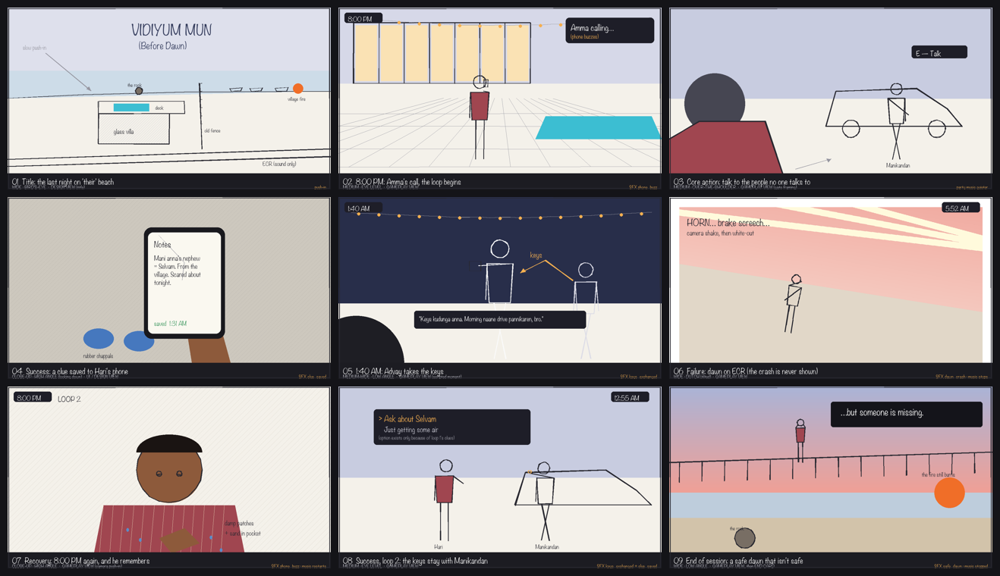
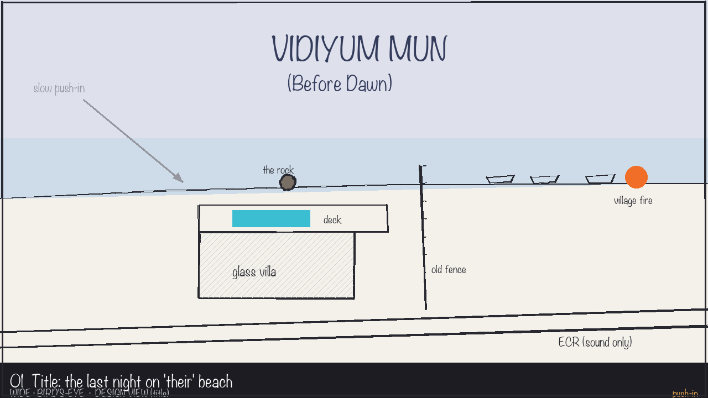
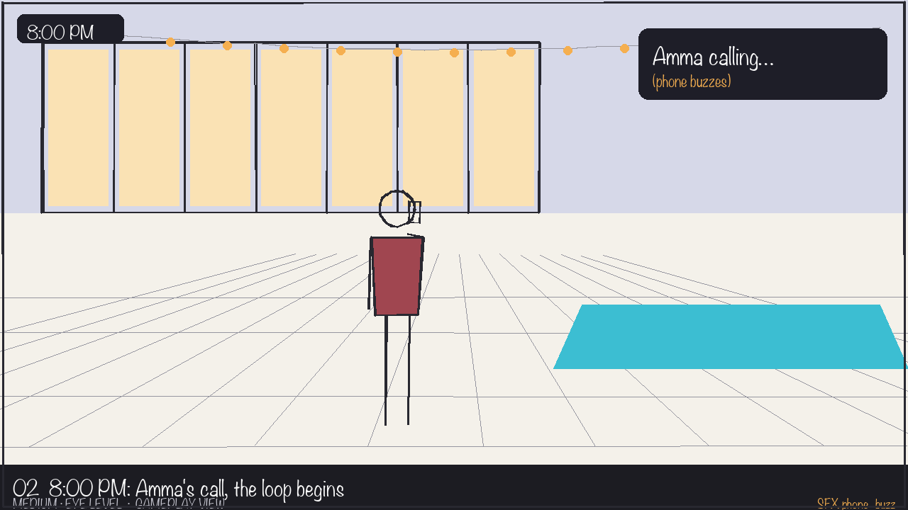
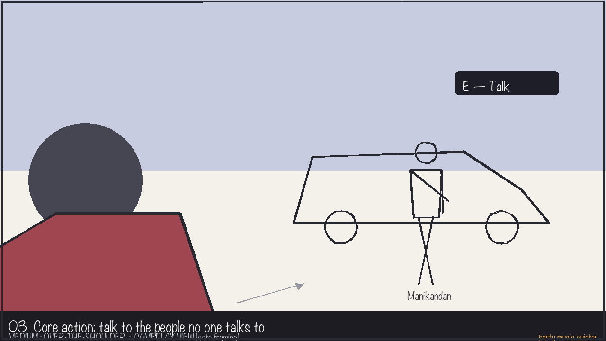
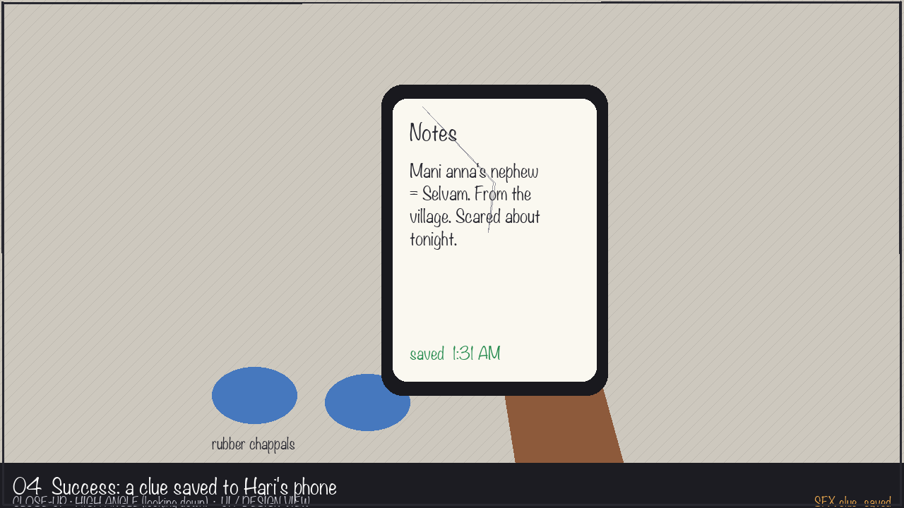
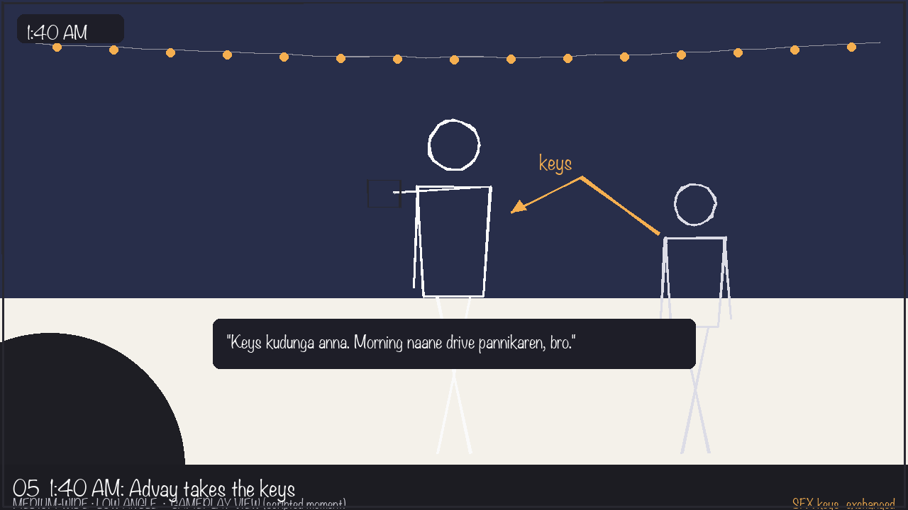
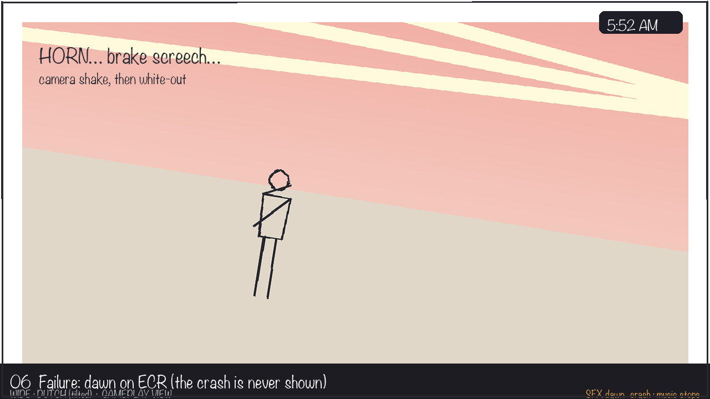
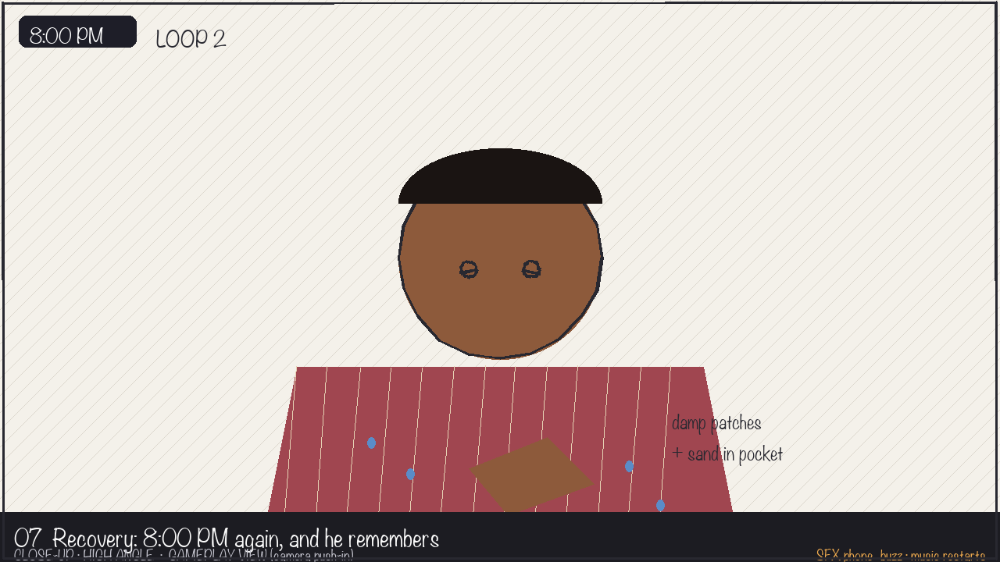
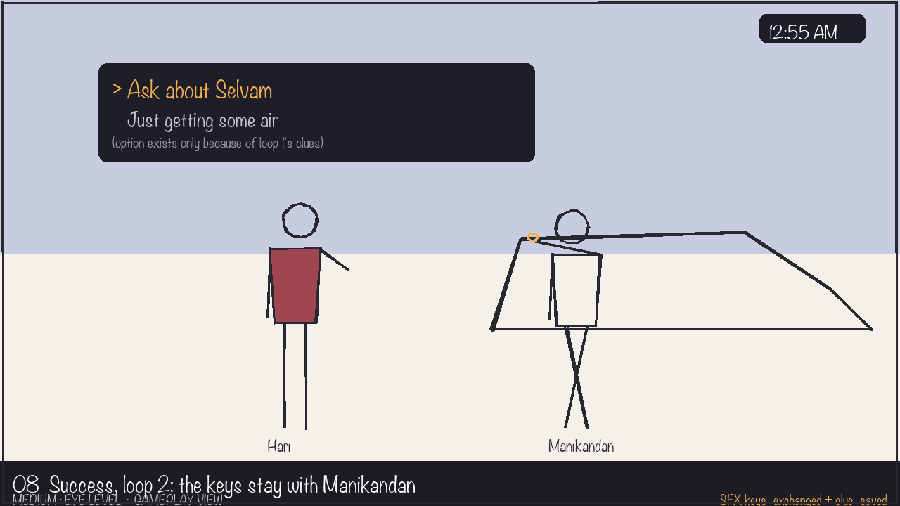
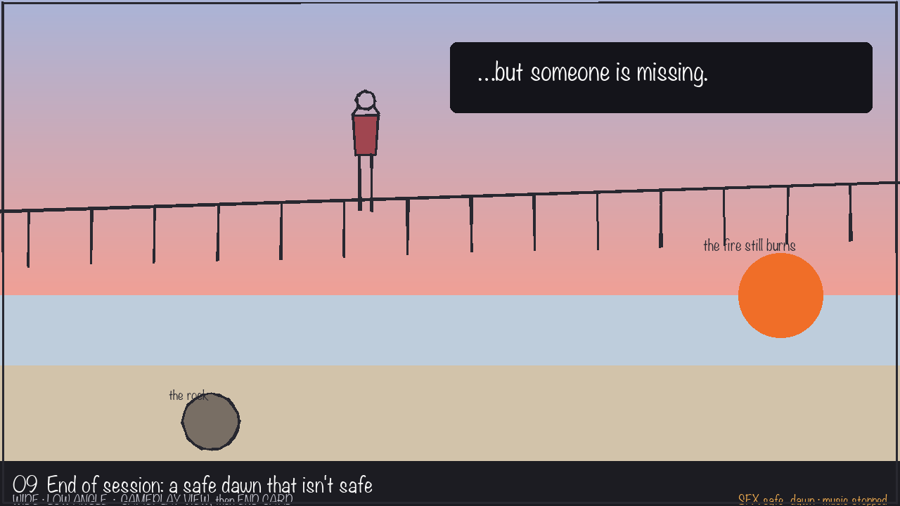

# Storyboard: Vidiyum Mun asset slice

*Revision 1, 2026-10-06, committed before any generation.*
*Beats: Shriram (`design/input/STORY-BIBLE-v1.md` section 13; the slice script in `-v2.md`). Thumbnails: code-drawn by Claude with Pillow (`tools/design/draw_storyboard.py`), at Shriram's request ("you sketch them for now"). They are design sketches, not model output.*

**Frame:** 16:9 (1280×720) throughout.
**Coverage:**
- **Views:** wide (01, 06, 09), medium or medium-wide (02, 03, 05, 08), close-up (04, 07).
- **Angles:** bird's-eye (01), eye level (02, 08), over-the-shoulder (03), high (04, 07), low (05, 09), Dutch (06).
- **Motion notes:** camera push-in (01, 07), walk arrow (03), keys arc (05), headlight sweep and shake (06).

Contact sheet: 

---

## Panel 1: Title, the last night on "their" beach

- **Shot:** wide · bird's-eye · **design view** (title screen) · slow camera push-in toward the deck
- **Player action:** presses Enter to start; the camera pushes in from above the coast to the deck
- **See:** the glass villa and pool deck above the private beach, the rock, the old fence, the village boats and their fire; ECR runs along the bottom; the title
- **Hear:** waves; both musics faint and distant (party loop and gaana loop mixed low)
- **Assets:** ENV-VILLA, ENV-BEACH, ENV-FIRE, MUS-PARTY, MUS-GAANA
- **Design reason** (*The night belongs to Chennai*): the whole conflict, a fenced rock between a villa and a village, is visible before the player moves.

## Panel 2: 8:00 PM, Amma's call, the loop begins

- **Shot:** medium · eye level · **gameplay view** (deck framing)
- **Player action:** none at first; the game starts the loop. Hari answers and lies ("at Krishna's place, studying"), then control returns.
- **See:** Hari in **PHONE**, warm villa glass behind, string lights, the pool, the HUD clock reading 8:00 PM, the "Amma calling…" phone card
- **Hear:** **SFX-PHONE-BUZZ** (once); the party music starts at full deck volume
- **Assets:** CHAR-HARI-PHONE, ENV-VILLA, ENV-MARBLE, SFX-PHONE-BUZZ, MUS-PARTY
- **Design reason** (*Dawn is always coming*): the night has a start, a clock, and a lie to his mother, which is the stake he carries all night.

## Panel 3: Core action, talk to the people no one talks to

- **Shot:** medium · over-the-shoulder (behind Hari) · **gameplay view** (gate framing, camera swings wider to include the SUV) · walk arrow toward Manikandan
- **Player action:** walks to the SUV, presses **E**; the dialogue opens and the game locks movement
- **See:** Hari in **WALK** then **TALK**; Manikandan leaning on the SUV in his own light; an "E — Talk" prompt
- **Hear:** the party music dips as Hari moves away from the deck; no event sound for an ordinary line
- **Assets:** CHAR-HARI-WALK, CHAR-HARI-TALK, NPC-MANI-IDLE, ENV-SUV, MUS-PARTY
- **Design reason** (*See the people nobody sees*): the core verb is to walk away from the party toward someone the party treats as furniture.

## Panel 4: Success, a clue saved to Hari's phone

- **Shot:** close-up · high angle (looking down at the phone in his hand) · **UI / design view** (shown in game as the clue card overlay)
- **Player action:** has just overheard Manikandan on the phone with Selvam (~1:20–1:40 AM); the game saves the clue
- **See:** Hari in **NOTES** (head down, phone at chest); the cracked phone with the note "Mani anna's nephew = Selvam…"; rubber chappals on marble
- **Hear:** **SFX-CLUE** (once per *new* clue)
- **Assets:** CHAR-HARI-NOTES, CHAR-HARI-OVERHEAR, NPC-MANI-PHONE, SFX-CLUE
- **Design reason** (*Every loop, you see more*): learning is the only progress, so it gets its own picture and its own sound.

## Panel 5: 1:40 AM, Advay takes the keys

- **Shot:** medium-wide · low angle (from wheel height) · **gameplay view** (scripted moment, control kept) · keys arc from Manikandan to Advay
- **Player action:** whatever he is doing, the timeline fires; if Hari is nearby he watches, and the clue is saved either way
- **See:** Advay with his speaker, towering in the low angle; Manikandan handing over the keys; a caption of Advay's line; the keys icon moving
- **Hear:** **SFX-KEYS** (once); party music continues
- **Assets:** NPC-ADVAY, NPC-MANI-IDLE, ENV-SUV, SFX-KEYS, SFX-CLUE
- **Design reason** (*See the people nobody sees*): the cause of the tragedy is a small moment nobody at the party notices.

## Panel 6: Failure, dawn on ECR (the crash is never shown)

- **Shot:** wide · Dutch (tilted) · **gameplay view** · headlight sweep across the deck, camera shake, then white-out
- **Player action:** none possible. At ~5:50 AM the game plays the failure and resets.
- **See:** the dawn sky, Hari small in frame in **WHITEOUT** (arm up against the light), the screen washing to white
- **Hear:** both musics cut; **SFX-DAWN-CRASH** (a horn swell into a brake screech, once); then silence
- **Assets:** CHAR-HARI-WHITEOUT, ENV-BEACH (dawn tint), SFX-DAWN-CRASH
- **Design reason** (*Dawn is always coming*): the player should feel what Hari feels: dread from a sound you never see.

## Panel 7: Recovery, 8:00 PM again, and he remembers

- **Shot:** close-up · high angle · **gameplay view** (camera starts close on Hari, then pulls back to deck framing)
- **Player action:** none for ~1.2 s; then Amma's call again, the same lie, and control returns with the notes kept
- **See:** Hari in **STARTLED**, hand on the damp patches on his shirt; "LOOP 2" and 8:00 PM on the HUD
- **Hear:** **SFX-PHONE-BUZZ** (once); the party music restarts from the top
- **Assets:** CHAR-HARI-STARTLED, CHAR-HARI-PHONE, SFX-PHONE-BUZZ, MUS-PARTY, MUS-GAANA
- **Design reason** (*Every loop, you see more*): the reset should feel like waking, not like a menu, and the damp shirt says "something happened to *you*".

## Panel 8: Success, loop 2, the keys stay with Manikandan

- **Shot:** medium · eye level · **gameplay view**
- **Player action:** reaches Manikandan before 1:40 and picks **Ask about Selvam** (the choice exists only because both loop 1 clues are saved). Manikandan agrees to keep the keys. At 1:40 he refuses Advay.
- **See:** Hari in **TALK**, then **KEYS** as the keys are shown and kept; the dialogue choice; Manikandan in his own light
- **Hear:** **SFX-KEYS** and **SFX-CLUE** (each once)
- **Assets:** CHAR-HARI-TALK, CHAR-HARI-KEYS, NPC-MANI-IDLE, SFX-KEYS, SFX-CLUE
- **Design reason** (*See the people nobody sees*): Hari wins trust by asking about Manikandan's own family, which nobody at the party has done.

## Panel 9: End of session, a safe dawn that isn't safe

- **Shot:** wide · low angle (from the sand, up at the railing) · **gameplay view**, then the **end card**
- **Player action:** reaches dawn with the keys safe; the game plays the safe dawn, then the end card (R restarts from loop 1, Esc quits)
- **See:** Hari in **RELIEF** at the railing; the dawn sky; the village fire still glowing; "…but someone is missing."
- **Hear:** music already stopped; **SFX-SAFE-DAWN** (waves and crows, once); then silence
- **Assets:** CHAR-HARI-RELIEF, ENV-BEACH, ENV-FIRE, SFX-SAFE-DAWN
- **Design reason** (*Dawn is always coming*): fixing one link of the chain isn't enough; the player should want loop 3.

---

**Panels outside the slice:** none of these panels show loops 3 onward, the beach or the village up close. Panel 1's bird's-eye shot is a design or title view: the game's camera never goes that high during play.
